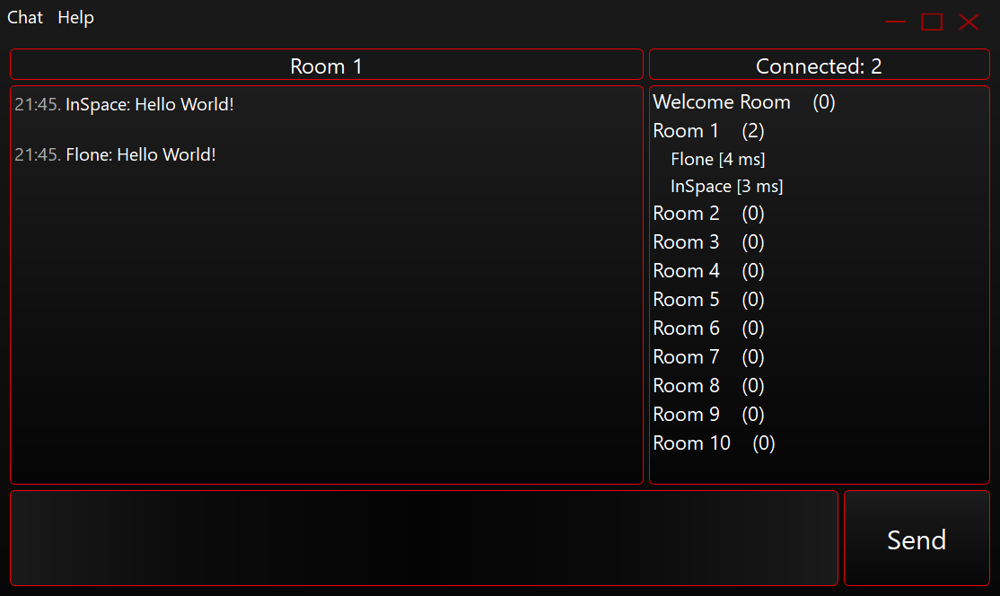

# Silent

  

 
Silent is a very lightweight text/voice chat client application. Must be used with the Silent Server application.  
 
Made with Qt Framework, Winsock2 and Windows Multimedia System.

# Add your style theme
The Silent has different style themes that you can change. 
 
To add your own theme you must go to the folder in which the Silent is installed. Then find folder "themes". In this folder, you will see themes that you can select in the Settings window. Copy and paste any .css file, rename it (only ASCII characters allowed) and change its content. After that, if you open the Silent - Settings Window you will see that your new theme can be selected there. 
 
If you want to see your theme in the official Silent build then you can make a pull request.

# Build
Silent is built with the MSVC 2017 64 bit compiler and Qt Framework (through Qt Creator). 
 
After you've built the app don't forget to copy-paste the "sounds" and "themes" folders to the folder with the .exe file.